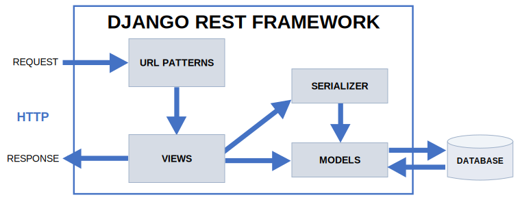
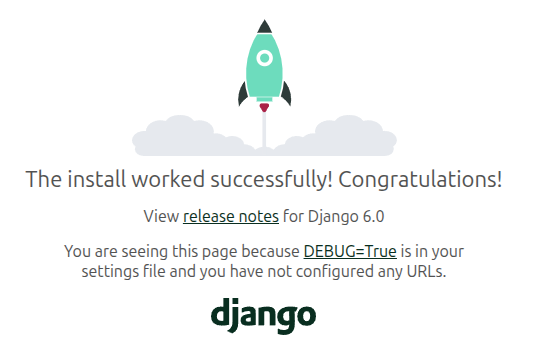
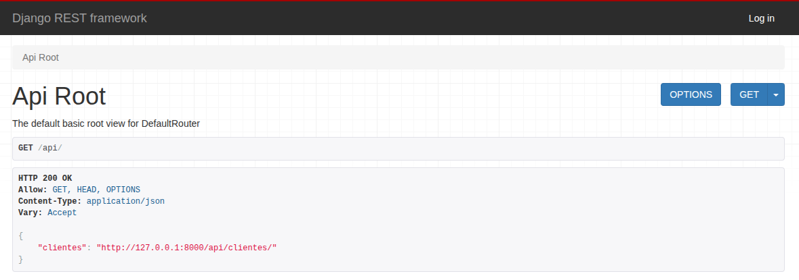
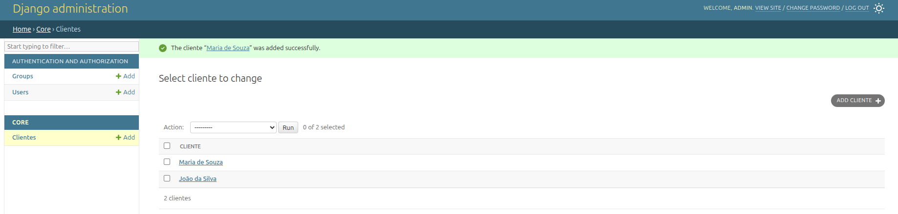
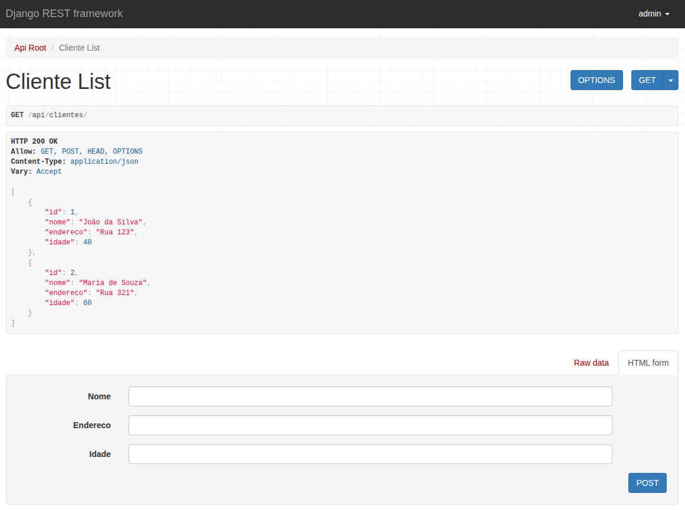
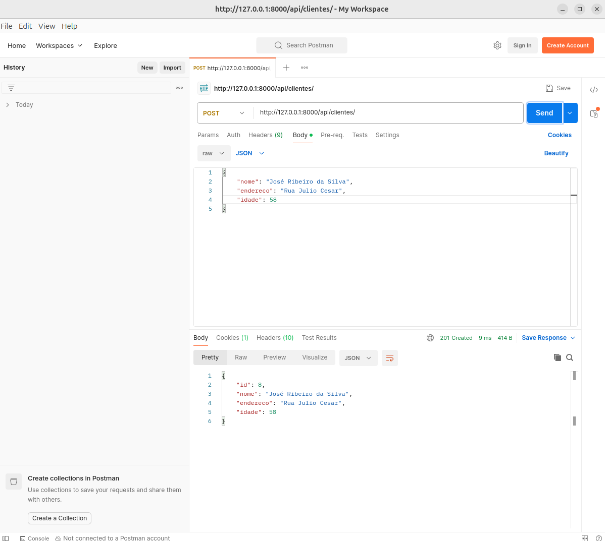
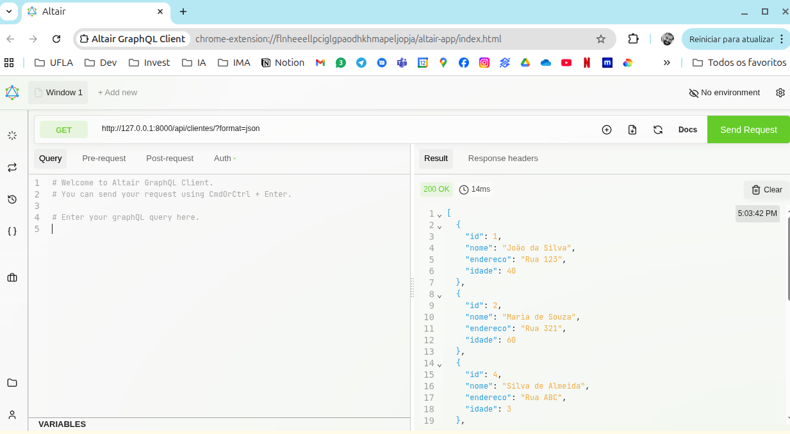
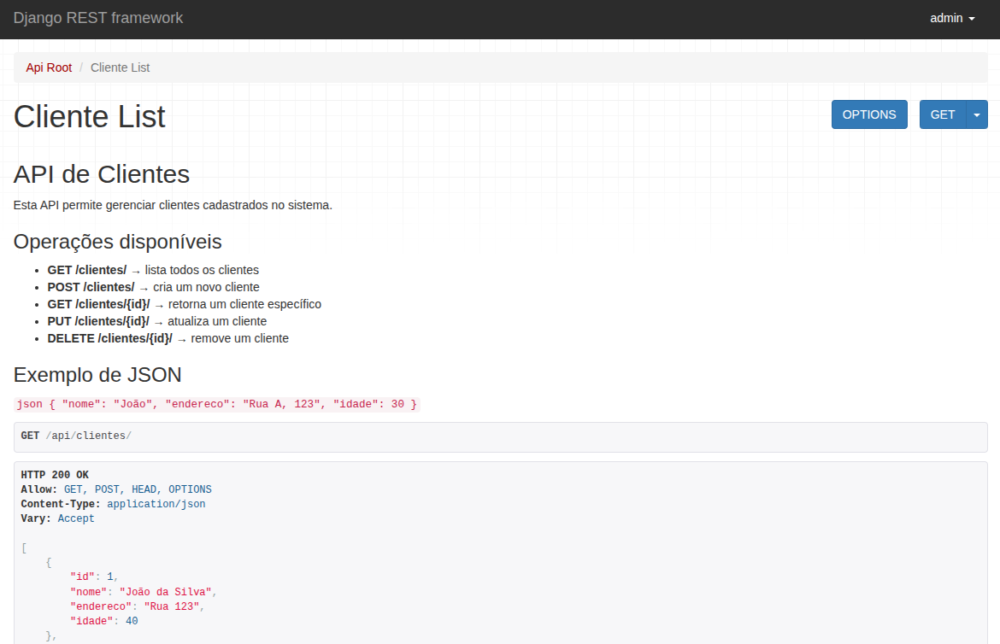

# Aula Django Rest Framework 01 - Visão Geral

<p align="center">
  <a href="#">
    
  </a>
  <a href="#">
    
  </a>
  <a href="#">
    
  </a>
</p>

## Índice

* [Introdução](#introdução)
* [Recursos Utilizados](#recursos-utilizados)
* [Fundamentos Teóricos](#fundamentos-teóricos)
* [Objetivo da Aula](#objetivo-da-aula)
* [Desenvolvimento do Projeto](#desenvolvimento-do-projeto)
* [Créditos e Referências](#créditos-e-referências)

## Introdução

<a href="#índice"></a>

O objetivo deste tutorial é apresentar uma visão geral do Django REST Framework (DRF) em que as principais funcionalidades do DRF são apresentadas. Esse projeto será utilizado na disciplina GAC116 - Programação Web da Universidade Federal de Lavras (UFLA).

Este tutorial foi elaborado com base na [videoaula de Django REST Framework](https://www.youtube.com/watch?v=gFsIGJR5R8I) e também no tutorial disponível na [documentação oficial do Django REST Framework](https://www.django-rest-framework.org/).

A aula está organizada no formato de tutorial, permitindo que cada estudante replique em seu computador os conceitos e recursos apresentados. O código será desenvolvido gradualmente, de modo a evidenciar a evolução da solução e facilitar a compreensão do DRF para a construção de aplicações web.

## Recursos Utilizados

<a href="#índice"></a>

A seguir estão listados os principais recursos empregados no desenvolvimento desta aula.

### Linguagens

* Python - Linguagem de programação principal
  * [Link do site Python](https://www.python.org/)
  * [Link do curso da W3Schools](https://www.w3schools.com/python/default.asp)

### Frameworks

* Django REST Framework - Framework web
  * [Link do site do Django REST Framework](https://www.django-rest-framework.org/)

### Bibliotecas

* Django-Filter - Biblioteca Python para Criação de Filtros
  * [Link Django-Filter](https://pypi.org/project/django-filter/)
* Django-Cors-Headers - Biblioteca Python para Compartilhamento de Recursos de Origem Cruzada (CORS)
  * [Link Django-Cors-Headers](https://pypi.org/project/django-cors-headers/)
* Markdown - Biblioteca Python para Markdown
  * [Link Markdown](https://pypi.org/project/Markdown/)

### Ferramentas

* Visual Studio Code - Ambiente de Desenvolvimento Integrado
  * [Link site Visual Studio](https://code.visualstudio.com/)
* Git - Sistema de controle de versão
  * [Link site do Git](https://git-scm.com/)
* Github - Plataforma de hospedagem e colaboração em projetos de software
  * [Link site do Github](https://github.com/)
* Pip - Gerenciador de pacotes do Python
  * [Link site do Pip](https://pypi.org/project/pip/)
* Venv - Ambiente virtual do Python
  * [Link site do Venv](https://docs.python.org/pt-br/3/library/venv.html)
* Postman - Cliente de API
  * [Link site do Postman](https://www.postman.com/)
* Altair - Cliente de API
  * [Link site do Altair](https://altairgraphql.dev/)

## Fundamentos Teóricos

<a href="#índice"></a>

A seguir estão destacados alguns dos principais fundamentos teóricos para entendimento deste tutorial.

### Django REST Framework

O Django REST Framework (DRF) é um framework em cima do framework Django. O DRF traz uma série de funcionalidades para criar APIs REST.

REST significa *Representational State Transfer* ou Transferência de Estado Representacional. REST é um estilo arquitetural que consiste em princípios/regras/restrições que permitem a comunicação entre aplicações.

* REST: conjunto de princípios de arquitetura.
* RESTful: capacidade de determinado sistema aplicar os princípios REST.

### Fluxo de Funcionamento

O Fluxo de Funcionamento do DRF inicia com o usuário entrando com uma rota (requisição). Essa rota leva a uma view. A view acessa os dados do Modelo e também do Serializers. O modelo interage com o BD. A resposta do BD é então devolvida para a View que responde ao usuário com um JSON de resposta. O fluxo do DRF está esquematizado na figura abaixo:



### Métodos HTTP usados no REST

REST utiliza os métodos padrão do HTTP para manipular recursos.

| Método | Função                 | Exemplo      |
| ------ | ---------------------- | ------------ |
| GET    | buscar dados           | `/alunos`    |
| POST   | criar recurso          | `/alunos`    |
| PUT    | atualizar recurso      | `/alunos/10` |
| PATCH  | atualizar parcialmente | `/alunos/10` |
| DELETE | remover recurso        | `/alunos/10` |

### Representação dos Dados

Um recurso pode ser representado em diferentes formatos:

* JSON (padrão mais usado)
* YAML
* XML
* HTML

## Objetivo da Aula

<a href="#índice"></a>

O objetivo desta aula é apresentar uma introdução ao Django REST Framework (DRF). Aprenderemos a configurar o DRF, a criar modelos, serializers, views, rotas, a acessar o Browsable API e como realizar o cadastro, leitura, atualização e exclusão (CRUD) de dados da API. O DRF é utilizado no desenvolvimento de páginas web do lado do servidor, ou seja, é uma ferramenta backend que expõe via API os recursos da nossa aplicação.

## Desenvolvimento do Projeto

<a href="#índice"></a>

Siga os passos abaixo para alcançar o objetivo da aula.

### Clonar o Repositório

Para iniciar, faça o clone do repositório com o seguinte comando:

```bash
git clone https://github.com/ufla-prog-web/aula-djangorest-01.git
```

### Baixar o Repositório

Como alternativa ao clone, você pode baixar diretamente o repositório acessando este [link](https://github.com/ufla-prog-web/aula-djangorest-01). Clique em `Code` e, em seguida, em `Download ZIP`.

### Instalar o Python

Se necessário, instale o Python [link](https://www.python.org/downloads/).

Verifique a versão instalada:

```bash
python3 --version
```

### Instalar o Pip

Se necessário, instale o pip:

```bash
sudo apt install python3-pip
```

Verifique a versão instalada:

```bash
python3 -m pip --version
```

### Abrir o Visual Studio Code

Abra o Visual Studio Code (VS Code) na pasta `aula-djangorest-01`.

**Dica:** abra o arquivo `README.md` e selecione a opção `Open Preview to the Side` para visualizar o tutorial lado a lado enquanto desenvolve a aplicação.

**Dica:** abra um terminal utilizando a IDE clicando em `Terminal` e `New Terminal`.

### Criar a Pasta do Projeto

Em seguida, crie, dentro da pasta `aula-djangorest-01`, a pasta do projeto denominada `code`:

```bash
cd aula-djangorest-01/
mkdir code
cd code/
```

### Criar o Ambiente Virtual

Crie um ambiente virtual para isolar as dependências do projeto:

```bash
python3 -m venv venv
```

**Observação:** no exemplo acima, o segundo nome `venv` é o nome que escolhemos para o nosso ambiente virtual (isso pode ser alterado).

### Ativar o Ambiente Virtual

Ative o ambiente virtual no seu computador utilizando o comando:

```bash
source venv/bin/activate
```

Para sair do ambiente virtual:

```bash
deactivate
```

### Instalar o Django REST Framework

Instale o Django REST Framework dentro do ambiente virtual criado:

```bash
python3 -m pip install djangorestframework
```

Verifique a versão instalada:

```bash
django-admin --version
```

ou

```bash
python3 -m django --version
```

**Observação:** caso o terminal não encontre o django-admin, execute o seguinte comando (utilizado geralmente quando não se utiliza o venv):

```bash
export PATH=$PATH:~/.local/bin
```

### Criar o Projeto no Django

Crie um projeto em Django utilizando o comando abaixo:

```bash
django-admin startproject api .
```

**Observação:** o ponto no comando acima informa ao Django para não criar uma pasta com nome `api` dentro de uma outra pasta `api`. Isso evita ter que ficar navegando entre pastas.

### Executar o Projeto

Inicie a execução do projeto Django:

```bash
python3 manage.py runserver
```

Acesse no navegador a página [http://127.0.0.1:8000/](http://127.0.0.1:8000/). A página padrão do Django deverá ser exibida (semelhante a imagem abaixo).



### Criar um Aplicativo

Crie um aplicativo (app) chamado `core` dentro do projeto (atenção: tem que parar o `runserver` ou executar em outro terminal):

```bash
django-admin startapp core
```

Em seguida, registre o aplicativo `core` em `INSTALLED_APPS` no arquivo `settings.py` conforme abaixo:

```python
INSTALLED_APPS = [
    'django.contrib.admin',
    'django.contrib.auth',
    'django.contrib.contenttypes',
    'django.contrib.sessions',
    'django.contrib.messages',
    'django.contrib.staticfiles',
    'core'                         #linha adicionada
]
```

### Criar Superusuário da Aplicação

Em seguida, execute o comando para realizar as migrações.

```bash
python manage.py migrate
```

Em seguida, execute o comando para criar um superusuário.

```bash
python manage.py createsuperuser
```

Em seguida, execute a aplicação.

```bash
python manage.py runserver
```

Acesse o admin do Django: [http://127.0.0.1:8000/admin/](http://127.0.0.1:8000/admin/).

### Registrar o REST Framework no Projeto

Em seguida, registre o aplicativo `rest_framework` em `INSTALLED_APPS` no arquivo `settings.py` conforme abaixo:

```python
INSTALLED_APPS = [
    ...
    'core',
    'rest_framework'             #linha adicionada
]
```

Inclua o caminho no arquivo `urls.py` na pasta `api` conforme abaixo:

```python
from django.contrib import admin
from django.urls import path, include                        #linha alterada

urlpatterns = [
    path('admin/', admin.site.urls),
    path("api-auth/", include("rest_framework.urls"))        #linha incluída
]
```

### Criar o Primeiro Modelo

Crie um modelo para representar um Cliente em `models.py` conforme código abaixo:

```python
...
class Cliente(models.Model):
    nome = models.CharField(max_length=100)
    endereco = models.CharField(max_length=100)
    idade = models.IntegerField()

    def __str__(self):
        return self.nome
```

Em seguida, execute os comandos:

```bash
python manage.py makemigrations
python manage.py migrate
```

### Registrar o Modelo no Django Admin

Registre o modelo criado no `admin.py` conforme código abaixo:

```python
...

from .models import Cliente

admin.site.register(Cliente)
```

Após isso, caso queira acesse o Django Admin para ver o modelo Cliente que agora está disponível para o CRUD.

### Criar o Primeiro Serialize

Crie na pasta `core` um arquivo `serializers.py` com o seguinte conteúdo.

```python
from rest_framework import serializers
from .models import Cliente

class ClienteSerializer(serializers.ModelSerializer):
    class Meta:
        model = Cliente
        fields = ["id", "nome", "endereco", "idade"]
```

**OBS**: na lista de campos acima (`fields`) coloque apenas os campos que deseja enviar como resposta. Não precisa ser todos os campos do modelo.

### Criar a Primeira View

No arquivo `views.py` coloque o seguinte conteúdo:

```python
from rest_framework import viewsets
from .models import Cliente
from .serializers import ClienteSerializer

class ClienteViewSet(viewsets.ModelViewSet):
    queryset = Cliente.objects.all()
    serializer_class = ClienteSerializer
```

### Cadastrar as Rotas

No arquivo `urls.py` da pasta `api` coloque o seguinte conteúdo:

```python
from django.contrib import admin
from django.urls import path, include
from rest_framework import routers             #acrescentei
from core.views import ClienteViewSet          #acrescentei

router = routers.DefaultRouter()               #acrescentei
router.register(r"clientes", ClienteViewSet)   #acrescentei

urlpatterns = [
    path("api/", include(router.urls)),        #acrescentei
    path('admin/', admin.site.urls),
    path("api-auth/", include("rest_framework.urls"))
]
```

Acesse o sistema através de [http://127.0.0.1:8000/api/](http://127.0.0.1:8000/api/).



### Cadastrar Objetos no Modelo via Admin

Nesta etapa, iremos cadastrar dois clientes usando o Admin do Django. Para isso, entre em [http://127.0.0.1:8000/admin/](http://127.0.0.1:8000/admin/) e clique em `Clientes` e realize o cadastro de dois clientes.

Na tela abaixo podemos ver dois clientes cadastrados via Django Admin.



Agora, vá tela do Browsable API em [http://127.0.0.1:8000/api/clientes/](http://127.0.0.1:8000/api/clientes/) e veja que os clientes cadastrados via Admin do Django estão listados após a consulta da rota `GET /api/clientes/`.



Dessa forma, o nosso primeiro recurso "Cliente" está disponível via API usando o Django REST Framework.

### Analisar o Recurso Cliente via Browsable API

Nesta etapa, iremos analisar o recurso Cliente que foi criado na tela do Browsable API.

**Visualização - GET**

Para isso, acesse os seguintes recursos:

* `GET /api/clientes/` - [http://127.0.0.1:8000/api/clientes/](http://127.0.0.1:8000/api/clientes/)
* `GET /api/clientes/1/` - [http://127.0.0.1:8000/api/clientes/1/](http://127.0.0.1:8000/api/clientes/1/)
* `GET /api/clientes/2/` - [http://127.0.0.1:8000/api/clientes/2/](http://127.0.0.1:8000/api/clientes/2/)

**Inclusão - PUT**

* `POST /api/clientes/` - [http://127.0.0.1:8000/api/clientes/](http://127.0.0.1:8000/api/clientes/)
    * Conteúdo da Mensagem:
        ```json
        {
            "nome": "Marcos Almeida",
            "endereco": "Rua ABC",
            "idade": 35
        }
        ```
* `POST /api/clientes/` - [http://127.0.0.1:8000/api/clientes/](http://127.0.0.1:8000/api/clientes/)
    * Conteúdo da Mensagem:
        ```json
        {
            "nome": "Silvia Almeida",
            "endereco": "Rua XYZ",
            "idade": 45
        }
        ```

**Remoção - DELETE**

* `DELETE /api/clientes/3/` - [http://127.0.0.1:8000/api/clientes/3/](http://127.0.0.1:8000/api/clientes/3/)

**Alteração - PUT**

O PUT envia todos os campos do objeto, mesmo os que não mudaram.

* `PUT /api/clientes/4/` - [http://127.0.0.1:8000/api/clientes/4/](http://127.0.0.1:8000/api/clientes/4/)
    * Conteúdo da Mensagem:
        ```json
        {
            "id": 4,
            "nome": "Silvia de Almeida",
            "endereco": "Rua XYZ",
            "idade": 46
        }
        ```

**Alteração - PATCH**

O PATCH envia apenas os campos que precisam ser alterados.

* `PATCH /api/clientes/4/` - [http://127.0.0.1:8000/api/clientes/4/](http://127.0.0.1:8000/api/clientes/4/)
    * Conteúdo da Mensagem:
        ```json
        {
            "endereco": "Rua 123",
            "idade": 60
        }
        ```

### Analisar o Recurso Cliente via Clientes de API

Existem outras formas de interagir com o recurso Cliente da nossa API. Uma dessas formas é usando um cliente de API com o Postman ou o Altair.

A imagem a seguir mostra uma interação usando o Postman.



A imagem a seguir mostra uma interação usando o Altair - Extensão do Google Chrome.



**Dica:** Utilize uma dessas ferramentas e realize os CRUD para se familiarizar com essas formas de interação.

### Documentar a API do Recurso Cliente

Nesta etapa, iremos melhorar a documentação da API Cliente na interface Browsable API. Para isso, execute os passos a seguir.

Instale o pacote markdown.

```bash
python3 -m pip install markdown
```

Em seguida, no arquivo `views.py` adicone a seguinte docstring.

```python
class ClienteViewSet(viewsets.ModelViewSet):
    """
    # API de Clientes

    Esta API permite gerenciar clientes cadastrados no sistema.

    ## Operações disponíveis

    - **GET /clientes/** → lista todos os clientes
    - **POST /clientes/** → cria um novo cliente
    - **GET /clientes/{id}/** → retorna um cliente específico
    - **PUT /clientes/{id}/** → atualiza um cliente
    - **DELETE /clientes/{id}/** → remove um cliente

    ## Exemplo de JSON

    ```json
    {
        "nome": "João",
        "endereco": "Rua A, 123",
        "idade": 30
    }
    ```
    """
    queryset = Cliente.objects.all()
    serializer_class = ClienteSerializer
```

Abra a URL [http://127.0.0.1:8000/api/clientes/](http://127.0.0.1:8000/api/clientes/) e veja o descrição sobre o uso da API Cliente. Após isso, uma tela semelhante a mostrada abaixo deverá ser exibida.



### Criar Filtros para os Recursos

Nesta etapa, iremos incluir o pacote `django-filter` para poder realizar filtragens sobre as nossa consultas.

Assim, instale o pacote `django-filter` com o comando:

```bash
python3 -m pip install django-filter
```

Em seguida, inclua o aplicativo `django_filters` no `INSTALLED_APPS` no `settings.py` como abaixo:

```python
INSTALLED_APPS = [
    ...
    'core',
    'rest_framework',
    'django_filters'            # linha incluída
]
```

Em seguida, no arquivo `view.py` realize as seguintes alterações:

```python
from django_filters.rest_framework import DjangoFilterBackend    #linha incluída

class ClienteViewSet(viewsets.ModelViewSet):
    ...
    serializer_class = ClienteSerializer
    filter_backends = [DjangoFilterBackend]                      #linha incluída     
    filterset_fields = ['idade', 'nome']                         #linha incluída
```

Agora, realize testes com o parâmetro incluso nas filtragens.

* `GET /api/clientes/?idade=60` - [http://127.0.0.1:8000/api/clientes/?idade=60](http://127.0.0.1:8000/api/clientes/?idade=60)
* `GET /api/clientes/?nome=João da Silva` - [http://127.0.0.1:8000/api/clientes/?nome=Jo%C3%A3o%20da%20Silva](http://127.0.0.1:8000/api/clientes/?nome=Jo%C3%A3o%20da%20Silva)

### Permitir Backend e Frontend em Domínios Diferentes

O pacote django-cors-headers é usado para permitir que aplicações em outros domínios acessem sua API Django. Ele resolve problemas de CORS (*Cross-Origin Resource Sharing* - Compartilhamento de Recursos de Origem Cruzada).

Esse problema aparece muito quando você tem:

* **backend**: Django REST API
* **frontend**: React, Vue, Angular ou outro servidor

E o backend e frontend estão executando em domínios ou portas diferentes.

Para resolver esse problema, execute o comando abaixo para instalar o django-cors-headers:

```bash
python3 -m pip install django-cors-headers
```

Em seguida, inclua o aplicativo `corsheaders` no `INSTALLED_APPS` no `settings.py` como abaixo:

```python
INSTALLED_APPS = [
    ...
    'rest_framework',
    'django_filters',
    'corsheaders'                               #linha incluída
]
```

Atualize a lista `MIDDLEWARE` (no topo) no arquivo `settings.py` como abaixo:

```python
MIDDLEWARE = [
    'corsheaders.middleware.CorsMiddleware',    #linha incluída
    ...
]
```

Em seguida, permita uma origem específica incluindo em `settings.py`:

```python
CORS_ALLOWED_ORIGINS = [
    "http://localhost:3000",
]
```

**OBS:** A variável acima `CORS_ALLOWED_ORIGINS` pode ser incluída em qualquer lugar do arquivo `settings.py`. Sugere-se incluí-la abaixo de `MIDDLEWARE`.

Como alternativa a linha acima, somente para desenvolvimento, inclua permitir qualquer origem:

```python
CORS_ALLOW_ALL_ORIGINS = True
```

**OBS:** Se você usar a variável `CORS_ALLOW_ALL_ORIGINS` então comente a variável `CORS_ALLOWED_ORIGINS`.

Para testar se está funcionando, abra o Inspecionar, vá na aba Console (JavaScript) e teste com o comando abaixo.

```javascript
fetch("http://localhost:8000/api/clientes/")
  .then(response => response.json())
  .then(data => console.log(data))
```

Analise a saída que lista os dados dos clientes, quando o CORS está habilitado.

Em seguida, coloque `False` na variável `CORS_ALLOW_ALL_ORIGINS` e teste novamente para ver a mensagem de erro.

### Acessar Resposta Via CURL

Nesta etapa, será mostrado como acessar a resposta do ambiente não apenas usando o Browsable API, mas também via `curl` usando a linha de comando.

Para isso, execute o comando abaixo:

```bash
curl -u admin -H 'Accept: application/json; indent=4' http://127.0.0.1:8000/api/clientes/
```

Em seguida, entre com a senha. E uma saída em JSON com os dados dos clientes será exibida.

## Créditos e Referências

<a href="#índice"></a>

Este tutorial foi inspirado nos seguintes materiais:

* [Documentação oficial do Django REST Framework](https://www.django-rest-framework.org/)
* [Videoaula de Django REST Framework](https://www.youtube.com/watch?v=gFsIGJR5R8I)
